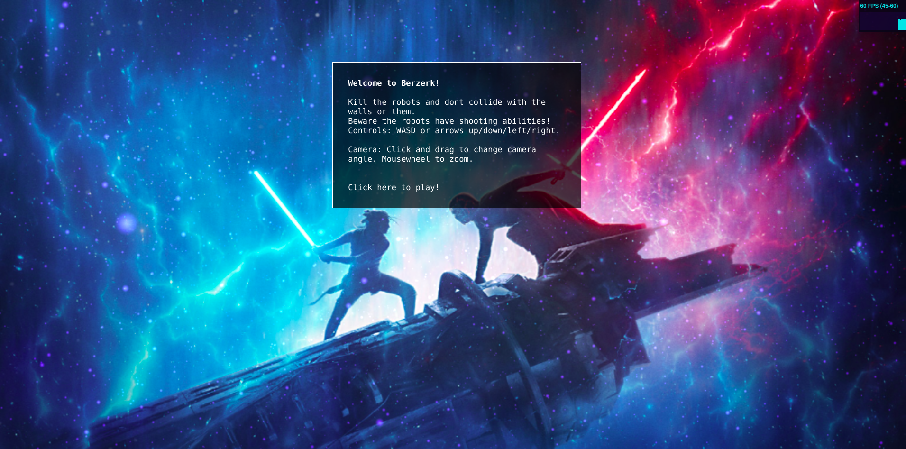
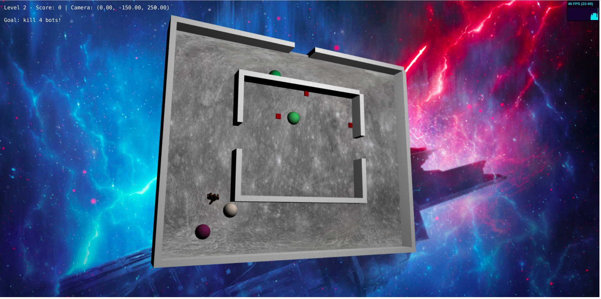

### CSC561 CG Final Program 
#### Game: Berzerk



#### Running the game
Run the game using Python3 HTTP Server

```bash
$python3 -m http.server
```

#### Libraries Used
- Three.js version 108
- Simple JavaScript Inheritance By John Resig http://ejohn.org/
- Mouse movements by Aaron Brandon https://github.com/brandonaaron

#### Completed Parts
- Part 1: Display the playing field
Create and render the playing environment needed for the game. You should display a roughly planar terrain surrounded by walls, and with other walls dividing the space. Models should be 3D, though the projections may be orthogonal. Fancy modeling is not necessary; cubes and spheres are enough. No motion is required for credit in this part.

- Part 2: Display and animate the player
Model and animate the player. It moves north, south, east or west when the user presses a key (wasd and/or arrows). The player dies if it hits a wall.

- Part 3: Display and animate the robots
Model and animate multiple robots. They move north, south east or west automatically, and do not pass through walls or each other. If they collide with the player, the player dies.

- Part 4: Add shooting interactions
Players can shoot in the (cardinal) direction they are moving by pressing the space bar. Robots will also automatically shoot at the player in cardinal directions. If robot shots hit the player, the player dies. Similarly, robot shots can kill other robots. Shots are not instant: they move slowly toward their target.

#### Extra Credits

- track and display score. 1 killed bot = 100 points
- animate the motion of the player and robots, using running keyframes
- play music, and on game events play a sound, e.g. on collisions. Sounds from http://soundbible.com/
- add at least one level, by navigating out of a door in the external wall

#### Screencast

Video Shared via GDrive: 